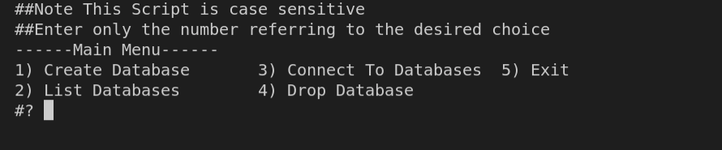
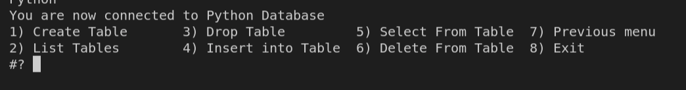
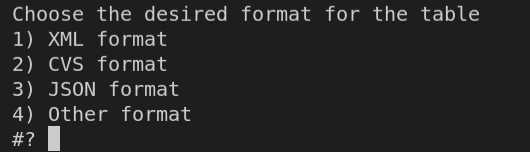
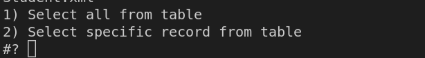

# Create Database with Bash Script

## Table of Contents
* [Main Menu](#main-menu)
  * [Notes For Main Menu](#notes-for-main-menu)
* [Connect To Databases Menu](#connect-to-databases-menu)
    * [Notes For Connect Menu](#notes-for-connect-menu)
* [Format Of Table Menu](#format-of-table-menu)
* [Selection Menu](#selection-menu)

## Main Menu
First Thing when we execute the Database.sh script main menu will appear to start to choose from as shown below in `Fig.1`. Whether to create new database (1) or list databases (2) or even drop databases(3).
To exit the bash script after finishing you can select Exit (5).
choice number 3 will connect you with the database you entered if it exists to open the next menu.   

#### Main Menu
1. Create Database
2. List Database
3. Connect To Databases
4. Drop Database
5. Exit

#### Notes For Main Menu
  - The working directory will be Databases after executing the script file (every database will be created in Databases folder).
  - Enter numbers only when choosing from the menu ( number referring to the desired choice).
  - This Script is case sensitive.

Fig.1

## Connect To Databases Menu
After choosing number 3 from the main menu you will be asked to enter the name of the database you want to connect to and it will be checked if it exist or not. if yes you will be directed to the connect menu as shown below in `Fig.2` else you will be still in the main menu.

#### Connect To Databases Menu
1. Create Table
2. List Tables
3. Drop Table
4. Insert Into Table
5. Select From Table
6. Delete From Table
7. Previous menu
8. Exit

when you chose to create table (1) it will ask you for the name of the table and the number of meta-characters (fields or columns heads of the table) and will ask for the first column name (primary key) then will ask for the names of other fields.
After entering the number and name of fields a new menu will appear [Format Of Table Menu](#format-of-table-menu) `Fig.3` to choose the format( file extension) of the table. table will be created with the headers entered.  

when you chose to insert into table (4) it will ask you for the name of the table if entered right with the extension you can insert rows(recorders). First you will be asked to enter the name of first field in meta-characters (which it is the primary key), it will be checked if it is a null value of a repeated value you will be notify with a message and will ask for another value, and then will be asked to fill each field in the table entered.

when you chose to select from table (5) it will ask you for the name of the table if entered right with the extension you will be directed to selection menu [Selection Menu](#selection-menu) `Fig.4`.

when you chose to delete from table (6) it will ask you for the name of the table if entered right with the extension then you will be ask for the name of primary key (unique key in the first field/column in the table entered). If the entered primary key does not exist or null value you will be notify with a message, else will delete the record of the primary key entered.

when you chose previous menu (7) will redirect you to the main menu above in `Fig.1`

when you chose Exit (8) will end the running script

#### Notes For Connect Menu
  - The working directory will change to the chosen database-name (every table will be created in the chosen database-name folder).
  - when asked for the numbers of meta-characters you can not enter null ( press the enter key without any values inserted) , and can not accept characters only numbers.
  - when asked for the name of fields (headers of table )you can not enter null(press the enter key without any values inserted).
  - every time you ask to enter the name of table consider the case sensitive and write full name of table with its file extension

Fig.2

## Format Of Table Menu
In the connect to database menu before creating the table it will ask for the desired format of the table as shown below `Fig.3`
You have four options here first one will be create the table with `xml` extension and second one will be `CVS` extension , and third one will be `JSON` and lastly the fourth option is for the user to determine what other extensions needed example `txt` extension
#### Select table extension for table
1. XML format
2. CVS format
3. JSON format
4. Other format

Fig.3

## Selection Menu
In the connect to database menu after choosing to select from table a new menu appeared as shown below `Fig.4` to select Whether all from the table entered or enter a primary key already exist in the table to show only the record with this primary key (notice primary keys unique and can not be null)
#### Select table extension for table
1. Select all from table
2. Select Specific record from table

Fig.4
